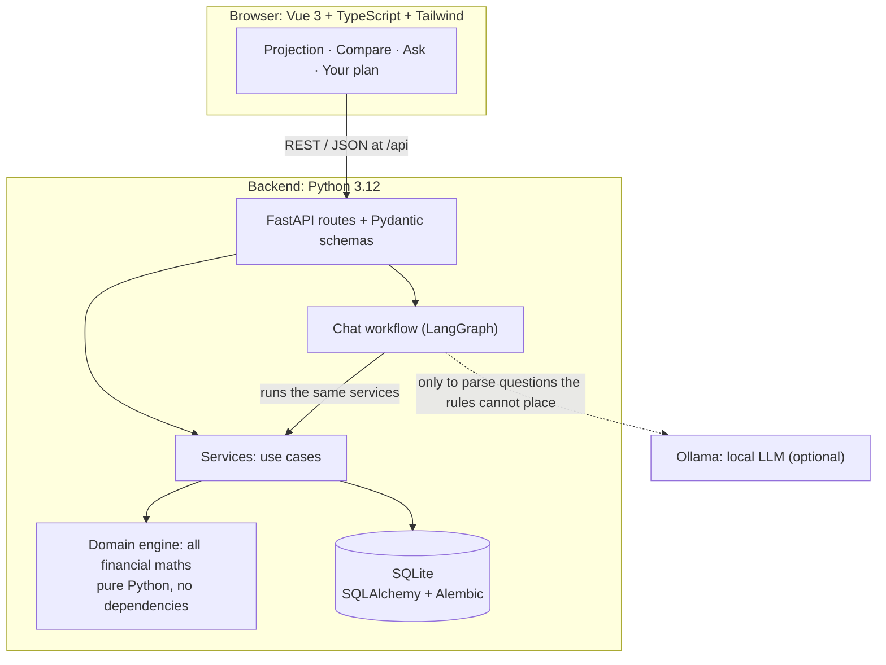
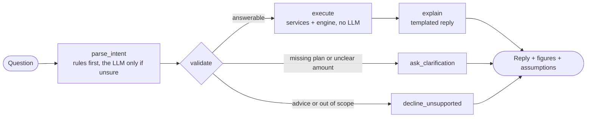

# Personal Finance Planning Assistant

A savings-goal simulator with a conversational interface. Enter your finances and a goal
("€80,000 for a house deposit by June 2032"), see when you're projected to reach it, compare
what-if scenarios, and ask questions in plain English: *"What if I invest €200 more per month?"*

**The core rule:** every number comes from a deterministic, tested Python engine. The language
model only helps understand questions; it never calculates, rounds or changes a figure. Every
answer shows the assumptions it depends on.

> A planning tool, not financial advice. Projections depend entirely on the assumptions you
> enter and are not guarantees.

## What it does

| Page | What you get |
|---|---|
| **Projection** | When the goal is reached, the value on the target date, the monthly amount needed to get there on time, and a month-by-month chart with a table view. Switch between conservative, base and optimistic assumptions. |
| **Compare** | Scenarios side by side (invest more, earn more, your own what-ifs), with differences from the current plan. |
| **Ask** | A chat that answers questions about your plan. Replies show the engine's figures as cards, how the question was understood, and whether rules or the model understood it. Advice requests are declined. |
| **Your plan** | Where a new user starts: two guided steps (your finances, your goal) with empty fields and examples, plus three editable assumption sets. |

Everything runs locally: SQLite for storage, and optionally [Ollama](https://ollama.com) for a
small local language model. Without a model, the chat still works with rules and templates.

## Architecture



Dependencies only point downwards. Automated tests enforce the boundaries: the domain engine
imports only the Python standard library, services never import the web or AI frameworks, and
the chat layer never imports the HTTP layer.

### How a chat message is answered



A question becomes a typed **intent**, one of a fixed set: on track, goal date, needed per month,
what-if, compare, assumptions, clarification or unsupported. The model can only choose from that
menu and fill in its blanks; deterministic code runs everything else. What-ifs never change the
saved plan, and follow-ups work ("and with €300 instead?").

## Keeping a language model honest

The model's output is checked before it's used, and anything that fails falls back to the rules:

- **Structured output:** Ollama constrains the model to a JSON schema.
- **Numbers must come from the question:** every amount the model extracts must appear in the
  user's message, and an assumption set must be named in it. This rejects invented values,
  such as a small model copying numbers from its own prompt examples.
- **Replies are templated by default:** when a small model reworded answers, it produced
  statements that passed a digits-only check but were wrong ("a month before" instead of 11
  months, an invented date, two scenarios merged). Rewording is available behind a setting,
  under a stricter check that requires every figure to be copied exactly.

**Measured, not assumed.** A labelled set of 35 messages (`python -m app.agents.evaluate`), some
phrased deliberately outside the rules' patterns:

| Strategy | phi3 (3.8B) | qwen2.5:3b |
|---|---|---|
| Rules only | 86% | 86% |
| Model alone | ~65% | 80% |
| Model first, rules as fallback | 74% | – |
| **Rules first, model when the rules are unsure** (used) | 89% | **91%** |

Letting the small model go first made results *worse*: its plausible-but-wrong answers pass
number checks. So the rules parse first, and the model handles only what they can't place. The
set is small and written by the author, so treat these numbers as a sanity check, not a benchmark.

## Engineering highlights

- **Financial model:** monthly simulation with annual salary and expense growth, returns
  compounded monthly to exactly the annual rate, contributions capped at available cash, debt
  payoff, and warnings when the plan runs short. The design and every simplification are in
  [docs/PHASE1_DESIGN.md](docs/PHASE1_DESIGN.md).
- **Property-based tests** (Hypothesis) check invariants over thousands of random plans. For
  example, investing the "required" amount really reaches the target on the target date. They
  caught a precision bug for returns close to zero.
- **Grounding tests:** every euro amount in a chat reply must come from the engine's results.
- **One contract, generated types:** the frontend's TypeScript types are generated from the
  API's OpenAPI description, and a test fails if they drift apart.
- **Database rules mirror the domain:** check constraints for non-negative money and valid
  rates, exactly one profile, and at most one active goal (a partial unique index). Migrations
  are tested against the models.
- **Accessible charts:** hand-drawn SVG with a keyboard crosshair, a table view, and colours
  validated for colour-blind readers in light and dark mode.
- **Decision log:** every notable trade-off is recorded with its reason in the design doc.

## Getting started

Requirements: Python 3.12+, Node.js 20+. Optional: Ollama, for the chat's language model.

### Windows, one command

```powershell
.\setup.ps1            # once: Python environment, packages, backend\.env
.\start.ps1            # build the UI and serve on http://127.0.0.1:8000 (add -Demo for a sample plan)
```

If PowerShell blocks scripts, run them as `powershell -ExecutionPolicy Bypass -File .\setup.ps1`.
The API's interactive documentation is at <http://127.0.0.1:8000/api/docs>.

For the language model: install Ollama, then `ollama pull qwen2.5:3b`. `backend/.env` selects
it (`LLM_PROVIDER=ollama`); without Ollama the chat falls back to rules.

### Any OS, step by step

```bash
cd backend
python -m venv .venv
.venv/bin/python -m pip install -e ".[dev]"      # Windows: .venv\Scripts\python.exe
cp .env.example .env                              # optional: chat model settings
.venv/bin/python -m app.seed                      # optional: sample plan (--empty starts over)

cd ../frontend
npm ci
npm run build

cd ../backend
.venv/bin/python -m uvicorn app.serve:create_site --factory   # http://127.0.0.1:8000
```

### Development

Two terminals, with hot reload:

```bash
# backend/
.venv/bin/python -m uvicorn app.main:app --reload    # API on :8000
# frontend/
npm run dev                                          # UI on http://localhost:5173, proxies /api
```

After changing the API, regenerate the frontend's types: `python -m app.export_openapi` in
`backend/`, then `npm run api:types` in `frontend/`.

## Testing

```bash
# backend/
.venv/bin/python -m pytest          # 320 tests: domain, database, services, API, chat
.venv/bin/ruff check . && .venv/bin/ruff format --check .
# frontend/
npm test                            # 67 tests: formatting, chart geometry, pages
npm run build                       # includes the type check
```

The test suite never needs a language model: it forces the rule-based provider. Two optional
extras use a real one: `OLLAMA_TESTS=1 pytest -k real_model` checks that the model doesn't make
parsing worse, and `python -m app.agents.evaluate --model qwen2.5:3b --show-misses` prints the
scores above. CI runs on every push (`.github/workflows/ci.yml`).

## Project structure

```
backend/
  app/
    domain/      financial engine: pure Python, all the maths
    db/          SQLAlchemy models, engine setup        (migrations/ holds Alembic)
    services/    use cases shared by the API and the chat
    schemas/     Pydantic request/response models
    api/         FastAPI routes
    agents/      chat workflow: intents, rule parser, LLM provider, templates, evaluation
    tools/       the actions the chat can run (wrapping services)
    main.py      the API app          serve.py   API + built UI on one server
  tests/         mirrors app/
frontend/
  src/
    views/       Projection, Compare, Ask, Your plan
    components/  chart, cards, forms, chat results
    api/         typed client + generated OpenAPI types
    lib/         formatting, chart geometry, unit conversion
docs/PHASE1_DESIGN.md   financial model, architecture, decision log
```

## Scope

Phase 1 is a single-user, local simulator. Deliberately out of scope: bank connections, market
data, investment recommendations, taxes, fees, debt interest, inflation-adjusted figures,
Monte Carlo simulation, accounts and authentication. Chat context is kept in memory and resets
when the server restarts.
