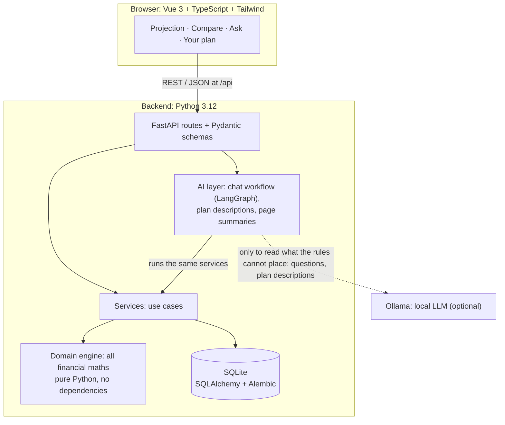

# Personal Finance Planning Assistant

A savings-goal simulator with a conversational interface. Describe your situation in your own
words ("I take home about 2,400 a month… I want 60k for a house deposit by June 2032") or fill in
a form, see when you're projected to reach the goal and how sure that is across 1,000 simulated
futures, compare what-if scenarios, and ask questions in plain English: *"What if I invest €200
more per month?"*, *"What if the market falls 30% next year?"*, *"How likely am I to reach my
goal?"*

**The core rule:** every number comes from a deterministic, tested Python engine. The language
model only helps read what people write (questions and descriptions); it never calculates,
rounds or changes a figure, and everything it reads is checked by code. Every answer shows the
assumptions it depends on.

> A planning tool, not financial advice. Projections depend entirely on the assumptions you
> enter and are not guarantees.

## What it does

| Page | What you get |
|---|---|
| **Projection** | Where you are today (progress towards the goal, net worth, savings rate), when the goal is reached, the value on the target date, the monthly amount needed to get there on time, and a month-by-month chart with a table view. **How sure is this?** 1,000 simulated futures with varying investment returns: the share that reaches the goal on time (with its precision), the range of goal dates, how the share grows year by year, and how far off the misses are, drawn as a band around the projection, and what it would take: the monthly investment that reaches the goal on time in half, 8 in 10 or 9 in 10 of the futures. Switch between conservative, base and optimistic assumptions. **What does this mean for me?** A plain-language summary of the page, on request. |
| **Compare** | Scenarios side by side (invest more, earn more, your own what-ifs), with differences from the current plan, including the share of simulated futures each one is on time in, all on the same futures. A plain-language summary on request. |
| **Ask** | A chat that answers questions about your plan. Replies show the engine's figures as cards, how the question was understood, and whether rules or the model understood it. Answers "how likely" from simulated futures and one-off market drops as what-ifs. What-ifs can be saved to Compare. Advice requests are declined. |
| **Your plan** | Where a new user starts. **Describe your situation** in your own words: the forms fill in as a draft, with how each value was worked out ("€900 + €700"), one question at a time for what's missing, and a "please check" label on anything the language model read. Nothing is saved until you check the forms and save them. Or fill in the forms directly: your finances, your goal, an investment risk level (low, medium, high), and three editable assumption sets. When you open the app with a plan saved, you choose: continue with it, or start fresh (after a confirmation; the assumption sets stay). |

Everything runs locally: SQLite for storage, and optionally [Ollama](https://ollama.com) for a
small local language model. Without a model, the chat still works with rules and templates.

## Architecture



Dependencies only point downwards. Automated tests enforce the boundaries: the domain engine
imports only the Python standard library, services never import the web or AI frameworks, and
the chat layer never imports the HTTP layer.

### How a chat message is answered


A question becomes a typed **intent**, one of a fixed set: on track, goal date, needed per month,
what-if, compare, assumptions, clarification or unsupported. The model can only choose from that
menu and fill in its blanks; deterministic code runs everything else. What-ifs never change the
saved plan, and follow-ups work ("and with €300 instead?").

## Keeping a language model honest

The model's output is checked before it's used, and anything that fails falls back to the rules:

- **Structured output:** Ollama constrains the model to a JSON schema.
- **Numbers must come from the question:** every amount the model extracts must appear in the
  user's message, and an assumption set must be named in it. This rejects invented values,
  such as a small model copying numbers from its own prompt examples.
- **Replies are templated by default:** when a small model reworded answers, it produced
  statements that passed a digits-only check but were wrong ("a month before" instead of 11
  months, an invented date, two scenarios merged). Rewording is available behind a setting,
  under a stricter check that requires every figure to be copied exactly.
- **The model never does arithmetic:** in a plan description it only copies what was written;
  "rent 900 and 700 for the rest" stays two parts and "36k a year" keeps its period, and the
  engine adds and converts them, visibly ("€900 + €700", "€36,000 a year ÷ 12").
- **What the model read is marked for a person to check:** its misreadings in the evaluation
  (a trip budget read as monthly spending) pass every number check, so the form labels exactly
  those fields "Read by the AI: please check" and nothing is saved without confirmation.
- **Summaries are facts chosen by code:** "What does this mean for me?" is built from the
  engine's results by rules; a model may only reword them, under the same checks.

**Measured, not assumed.** A labelled set of messages (`python -m app.agents.evaluate`), some
phrased deliberately outside the rules' patterns. It had 35 messages in Phase 1 and 43 since
Phase 2 added likelihood and market-drop questions:

| Strategy | phi3 (3.8B), 35 messages | qwen2.5:3b, 35 | qwen2.5:3b, 43 |
|---|---|---|---|
| Rules only | 86% | 86% | 84% |
| Model alone | ~65% | 80% | 81% |
| Model first, rules as fallback | 74% | – | – |
| **Rules first, model when the rules are unsure** (used) | 89% | 91% | **95%** |

Letting the small model go first made results *worse*: its plausible-but-wrong answers pass
number checks. So the rules parse first, and the model handles only what they can't place.

The same strategy reads plan descriptions. A labelled set of 30 descriptions (79 fields), scored
field by field as correct, missing or **wrong** (the costly kind: a missing value gets a question,
a wrong one may go unnoticed), with `python -m app.agents.evaluate_setup`:

| Reader | Fields right | Wrong | Descriptions fully right |
|---|---|---|---|
| Rules only | 85% | 4 | 22 / 30 |
| qwen2.5:3b alone | 66% | 14 | 10 / 30 |
| **Rules, then qwen2.5:3b** (used) | **91%** | 6 | 23 / 30 |

And four local models compared on every task, on the same sets:

| | phi3 (3.8B) | qwen2.5:3b | qwen3:4b | **qwen3:4b-instruct** (used) |
|---|---|---|---|---|
| Chat questions, rules then model | 86% | 95% | 95% | **95%** |
| Plan descriptions, rules then model | 89% | 91% | 90% | 89% |
| Wrong values, rules then model | 6 | 6 | 6 | **5** |
| Time per message, model alone | ~1.7 s | ~1.2 s | ~3.0 s | **~0.5 s** |
| Page summaries passing the checks (11 pages) | 1 | 0 | – (its reasoning leaks into free text) | **10** |

The summaries settled a design question. The 3B models misstated facts on almost every page,
and the few texts that passed the figure checks were still wrong in meaning ("You have €80,000"
when €105,000 covers an €80,000 goal). qwen3:4b-instruct writes far better, but reading its ten
passing texts still found a fact misapplied ("in 9 of 10 cases the goal would be missed by
€29,050", where €29,050 is the typical miss) and two cut off mid-sentence. So summaries are the
code-chosen facts by default (`python -m app.agents.evaluate_summaries --model …` to measure
another model). qwen3:4b-instruct is used: as accurate as the others where the app uses a model,
with the fewest wrong values, and the fastest. The sets are small and written by the author, so
treat these numbers as a sanity check, not a benchmark.

## Engineering highlights

- **Financial model:** monthly simulation with annual salary and expense growth, returns
  compounded monthly to exactly the annual rate, contributions capped at available cash, debt
  payoff, and warnings when the plan runs short. The design and every simplification are in
  [docs/PHASE1_DESIGN.md](docs/PHASE1_DESIGN.md).
- **Property-based tests** (Hypothesis) check invariants over thousands of random plans. For
  example, investing the "required" amount really reaches the target on the target date. They
  caught a precision bug for returns close to zero.
- **Monte Carlo without giving up determinism:** yearly returns are lognormal around the
  assumed return, so the median future follows the projection line exactly; a fixed seed makes
  every result reproducible, and all scenarios share the same random draws, so differences come
  from the plan, not from luck. Standard library only. The tests caught a real subtlety: moving
  money from cash to investments raises the typical outcome but can lower the worst ones. See
  [docs/PHASE2_DESIGN.md](docs/PHASE2_DESIGN.md).
- **The AI as a guide, measured:** a description fills a draft of the forms that a person
  confirms; summaries are facts chosen by code. Measuring the model on both changed the design
  twice: model-read values are flagged for review, and summaries stay templated. See
  [docs/PHASE3_DESIGN.md](docs/PHASE3_DESIGN.md).
- **Grounding tests:** every euro amount and percentage in a chat reply must come from the
  engine's results.
- **One contract, generated types:** the frontend's TypeScript types are generated from the
  API's OpenAPI description, and a test fails if they drift apart.
- **Database rules mirror the domain:** check constraints for non-negative money and valid
  rates, exactly one profile, and at most one active goal (a partial unique index). Migrations
  are tested against the models.
- **Accessible charts:** hand-drawn SVG with a keyboard crosshair, a table view, and colours
  validated for colour-blind readers in light and dark mode.
- **Decision log:** every notable trade-off is recorded with its reason in the design doc.

## Getting started

Requirements: Python 3.12+, Node.js 20+. Optional: Ollama, for the chat's language model.

### Windows, one command

```powershell
.\setup.ps1            # once: Python environment, packages, backend\.env
.\start.ps1            # build the UI and serve on http://127.0.0.1:8000 (add -Demo for a sample plan)
```

If PowerShell blocks scripts, run them as `powershell -ExecutionPolicy Bypass -File .\setup.ps1`.
The API's interactive documentation is at <http://127.0.0.1:8000/api/docs>.

For the language model: install Ollama, then `ollama pull qwen3:4b-instruct`. `backend/.env` selects
it (`LLM_PROVIDER=ollama`); without Ollama the chat falls back to rules.

### Any OS, step by step

```bash
cd backend
python -m venv .venv
.venv/bin/python -m pip install -e ".[dev]"      # Windows: .venv\Scripts\python.exe
cp .env.example .env                              # optional: chat model settings
.venv/bin/python -m app.seed                      # optional: sample plan (--empty starts over)

cd ../frontend
npm ci
npm run build

cd ../backend
.venv/bin/python -m uvicorn app.serve:create_site --factory   # http://127.0.0.1:8000
```

### Development

Two terminals, with hot reload:

```bash
# backend/
.venv/bin/python -m uvicorn app.main:app --reload    # API on :8000
# frontend/
npm run dev                                          # UI on http://localhost:5173, proxies /api
```

After changing the API, regenerate the frontend's types: `python -m app.export_openapi` in
`backend/`, then `npm run api:types` in `frontend/`.

## Testing

```bash
# backend/
.venv/bin/python -m pytest          # 538 tests: domain, database, services, API, chat
.venv/bin/ruff check . && .venv/bin/ruff format --check .
# frontend/
npm test                            # 109 tests: formatting, chart geometry, pages
npm run build                       # includes the type check
```

The test suite never needs a language model: it forces the rule-based provider. Two optional
extras use a real one: `OLLAMA_TESTS=1 pytest -k real_model` checks that the model doesn't make
parsing worse, and `python -m app.agents.evaluate --model qwen3:4b-instruct --show-misses`,
`python -m app.agents.evaluate_setup --model qwen3:4b-instruct --show-misses` and
`python -m app.agents.evaluate_summaries --model qwen3:4b-instruct --show` print the scores
above. CI runs on every push (`.github/workflows/ci.yml`).

## Project structure

```
backend/
  app/
    domain/      financial engine: pure Python, all the maths
    db/          SQLAlchemy models, engine setup        (migrations/ holds Alembic)
    services/    use cases shared by the API and the chat
    schemas/     Pydantic request/response models
    api/         FastAPI routes
    agents/      chat workflow, plan descriptions, page summaries: rules, LLM provider,
                 templates, checks, evaluations
    tools/       the actions the chat can run (wrapping services)
    main.py      the API app          serve.py   API + built UI on one server
  tests/         mirrors app/
frontend/
  src/
    views/       Projection, Compare, Ask, Your plan
    components/  chart, cards, forms, chat results
    api/         typed client + generated OpenAPI types
    lib/         formatting, chart geometry, unit conversion, wording
docs/PHASE1_DESIGN.md   financial model, architecture, decision log
docs/PHASE2_DESIGN.md   uncertainty: simulated futures (Monte Carlo)
docs/PHASE3_DESIGN.md   the AI as a guide: describe your plan, page summaries
```

## Scope

A single-user, local simulator. Phase 2 adds uncertainty for investment returns only (income,
expenses and inflation stay as planned); Phase 3 uses the language model to guide (reading
descriptions, wording summaries), never to calculate or advise. Deliberately out of scope: bank
connections, market data, investment recommendations, taxes, fees, debt interest,
inflation-adjusted figures, accounts and authentication. Chat context is kept in memory and
resets when the server restarts; descriptions and summaries are never stored.
